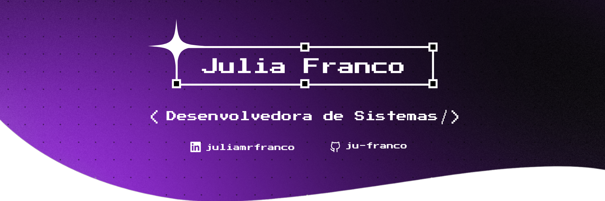

  

## `☕ Sobre Mim`

🎓 Estudante de Análise e Desenvolvimento de Sistemas na FATEC Campinas  
📚 Técnica em Desenvolvimento de Sistemas  
✨ Desenvolvedora Front-end, entusiasta de design gráfico e UI/UX

## `🏆 Conquistas e Experiências`

📚 GLAUKS – Sistema de Gestão e Mapeamento para Bibliotecas Escolares (TCC)
> Voltado à *modernização de bibliotecas escolares, incentivo à leitura e democratização do acesso ao conhecimento*. Possui um *aplicativo mobile* para alunos, com busca e visualização de obras, e uma *plataforma web* administrativa para catalogação, controle de empréstimos e gerenciamento interno

🏅 Projeto participante da 13ª Mostra de Ciências e Tecnologia do Instituto 3M e medalhista de bronze na 13ª edição da PROJETEC 

##  `💻 Tecnologias / Ferramentas / Softwares`

  

## `📫 Contato`

